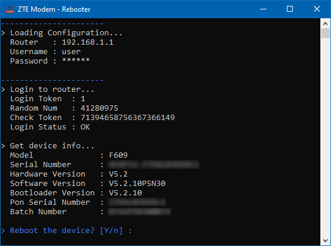

# ZTE MODEM REBOOTER
alat untuk mempermudah reboot modem. tidak perlu buka browser. tidak perlu memasukkan user & pass berualang-ulang. tinggal eksekusi. done!

configurasi tersimpan di `[file-exe].config`

## Screenshot
